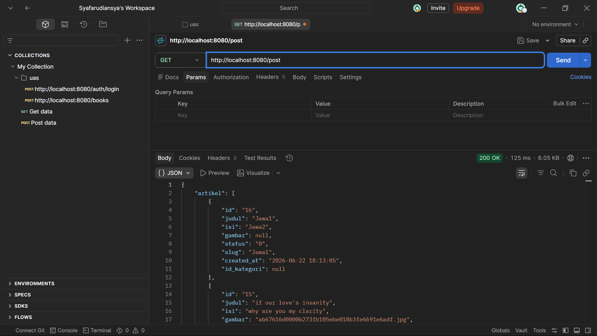
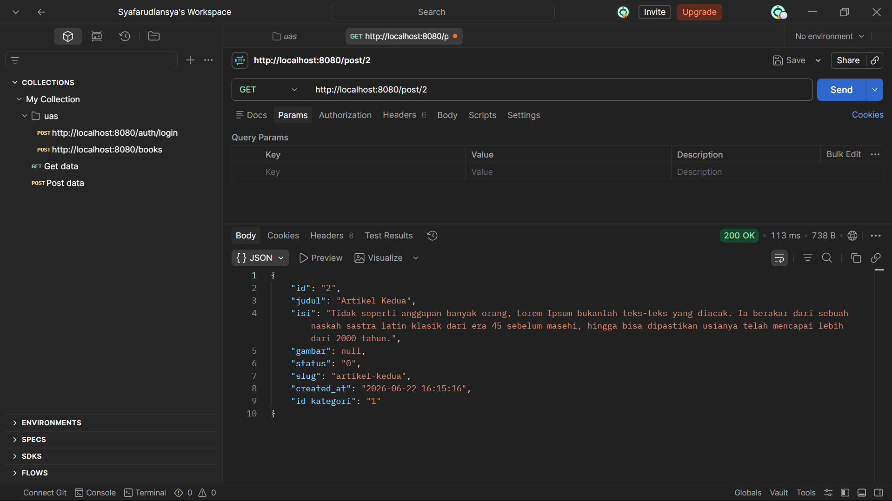
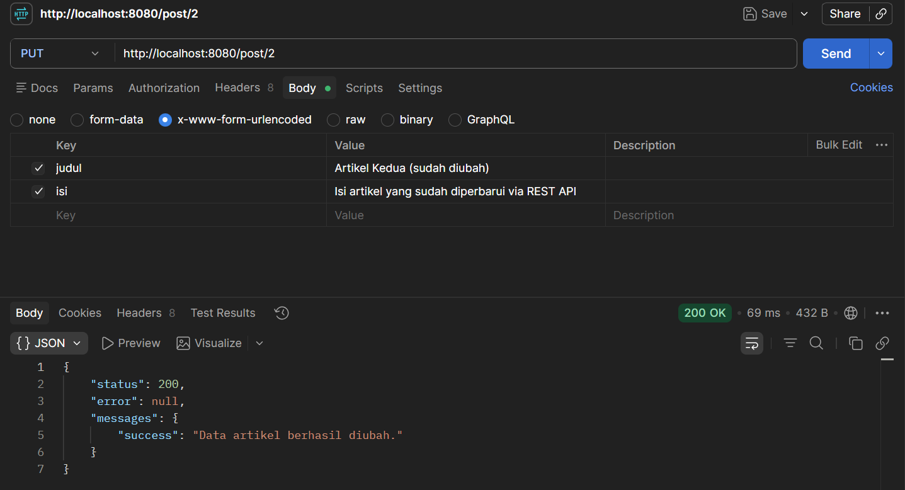

# Laporan Praktikum 10: RESTful API (CodeIgniter 4)

Repository ini dibuat untuk memenuhi tugas mata kuliah Pemrograman Web 2. Praktikum ini berfokus pada pemahaman konsep dasar API, arsitektur RESTful, serta bagaimana membangun dan menguji REST API menggunakan Framework CodeIgniter 4 dan *tools* REST Client (seperti Postman atau sejenisnya).

## Tujuan Praktikum
1. Mahasiswa mampu memahami konsep dasar API (Application Programming Interface).
2. Mahasiswa mampu memahami konsep dasar arsitektur RESTful.
3. Mahasiswa mampu membuat dan mengimplementasikan API menggunakan Framework CodeIgniter 4.

---

## Konsep Dasar REST API
*Representational State Transfer* (REST) adalah salah satu desain arsitektur *Application Programming Interface* (API). API sendiri merupakan antarmuka (*interface*) yang menjadi perantara untuk menghubungkan satu aplikasi dengan aplikasi lainnya. 

REST API berisi aturan-aturan untuk membuat *web service* dengan membatasi hak akses *client* yang mengakses *resource* server demi melindungi data penting. Sistem ini bekerja menggunakan prinsip REST Server (penyedia *resource*/data) dan REST Client (yang melakukan HTTP Request menggunakan URI atau Global ID). Server kemudian memproses permintaan tersebut dan mengembalikan respon (Response) dalam format data terstruktur seperti **JSON**.

---

## Langkah-Langkah Praktikum & Penjelasan

### 1. Membuat RESTful Controller (`Post.php`)
Di dalam CodeIgniter 4, pembuatan REST API dipermudah dengan adanya `ResourceController`. Kita membuat sebuah *controller* baru bernama `Post.php` di dalam folder `app/Controllers/`. Controller ini bertugas menyediakan *endpoint* data artikel dari `ArtikelModel` untuk keperluan operasi CRUD (Create, Read, Update, Delete) via API.

Berikut adalah kode implementasi pada **`app/Controllers/Post.php`**:

```php
<?php

namespace App\Controllers;

use CodeIgniter\RESTful\ResourceController;
use CodeIgniter\API\ResponseTrait;
use App\Models\ArtikelModel;

class Post extends ResourceController
{
    use ResponseTrait;

    // 1. GET - Mengambil semua data artikel
    public function index()
    {
        $model = new ArtikelModel();
        $data = $model->findAll();
        return $this->respond($data, 200);
    }

    // 2. GET - Mengambil satu data artikel berdasarkan ID
    public function show($id = null)
    {
        $model = new ArtikelModel();
        $data = $model->getWhere(['id' => $id])->getResult();
        
        if ($data) {
            return $this->respond($data);
        } else {
            return $this->failNotFound('Data tidak ditemukan dengan ID ' . $id);
        }
    }

    // 3. POST - Membuat/Menambah data artikel baru
    public function create()
    {
        $model = new ArtikelModel();
        $data = [
            'judul' => $this->request->getVar('judul'),
            'isi'   => $this->request->getVar('isi')
        ];
        $model->insert($data);
        
        $response = [
            'status'   => 201,
            'error'    => null,
            'messages' => [
                'success' => 'Data artikel berhasil ditambahkan.'
            ]
        ];
        return $this->respondCreated($response);
    }

    // 4. PUT/PATCH - Memperbarui data artikel berdasarkan ID
    public function update($id = null)
    {
        $model = new ArtikelModel();
        $json = $this->request->getJSON();
        
        if ($json) {
            $data = [
                'judul' => $json->judul,
                'isi'   => $json->isi
            ];
        } else {
            $input = $this->request->getRawInput();
            $data = [
                'judul' => $input['judul'],
                'isi'   => $input['isi']
            ];
        }

        // Eksekusi Update data
        $model->update($id, $data);
        
        $response = [
            'status'   => 200,
            'error'    => null,
            'messages' => [
                'success' => 'Data artikel berhasil diperbarui.'
            ]
        ];
        return $this->respond($response);
    }

    // 5. DELETE - Menghapus data artikel berdasarkan ID
    public function delete($id = null)
    {
        $model = new ArtikelModel();
        $data = $model->find($id);
        
        if ($data) {
            $model->delete($id);
            $response = [
                'status'   => 200,
                'error'    => null,
                'messages' => [
                    'success' => 'Data artikel berhasil dihapus.'
                ]
            ];
            return $this->respondDeleted($response);
        } else {
            return $this->failNotFound('Data tidak ditemukan dengan ID ' . $id);
        }
    }
}
```
### 2. Konfigurasi Routing RESTful (Routes.php)
Agar endpoint URL Controller di atas dapat dipetakan secara otomatis oleh sistem CodeIgniter sesuai dengan verb HTTP standar (GET, POST, PUT, DELETE), buka file app/Config/Routes.php dan tambahkan baris berikut:

```php
$routes->resource('post');
```

Hasil Pengujian API (Screenshots)
Pengujian dilakukan menggunakan REST Client (seperti Postman / Thunder Client) dengan mengakses URL dasar: http://localhost:8080/post.

1. Menampilkan Semua Data
Request dikirim dengan method GET ke alamat http://localhost:8080/post untuk mendapatkan seluruh data berformat JSON.



2. Menampilkan Data Spesifik
Request dikirim dengan method GET ke alamat http://localhost:8080/post.



3. Memperbarui Data
Request dikirim dengan method PUT menuju URL spesifik ID, misalnya http://localhost:8080/post/2, membawa struktur body data baru yang ingin diubah.


